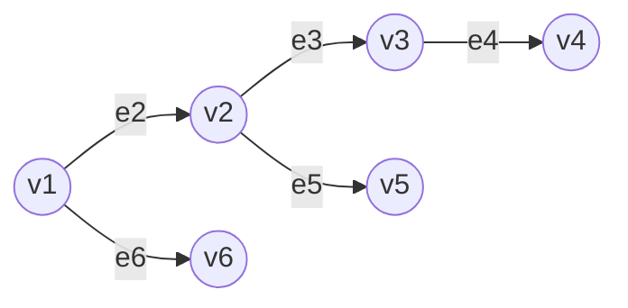

# オイラーツアー

オイラーツアーは根つき木を1次元配列に展開する手法である。これにより、セグメント木などのデータ構造を利用することができる。

## アルゴリズム

DFS順序で`i`番目に訪れた頂点を`DFS_V[i]`とかく。すべての辺をちょうど2回ずつ通るので、`DFS_V`の長さは\\( 2V - 1 \\)である。あるいは、`i`番目に通ったエッジを`DFS_E[i]`とかくと、`DFS_E`の長さは\\( 2V - 2 \\)である。

